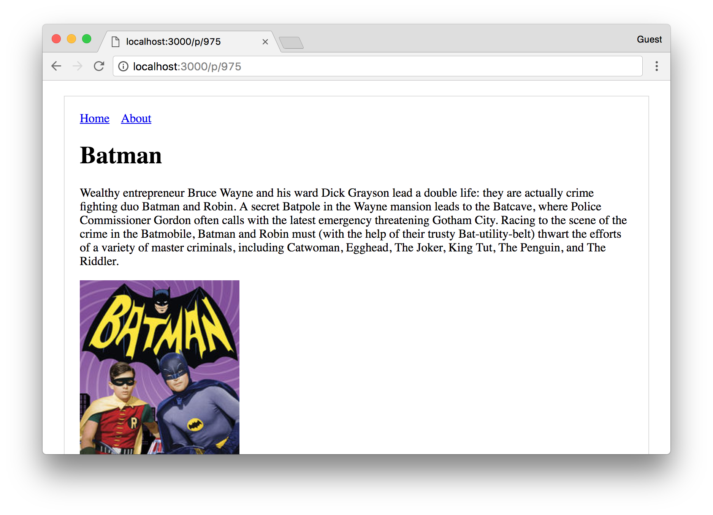

# Tv-show
> Fetching Batman Tv Shows, using the public [TVmaze API](http://www.tvmaze.com/api)



## Getting Started 🚀

* ```$ git clone https://github.com/ragmha/tv-show```

* ```$ yarn```

* ```$ yarn start -s```


## License
[MIT](./license) © [Raghib Hasan](http://raghibm.com/)


## Reference
[LearnNextJs](https://learnnextjs.com/)